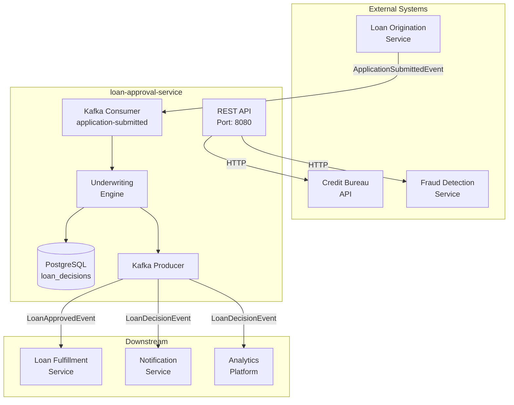
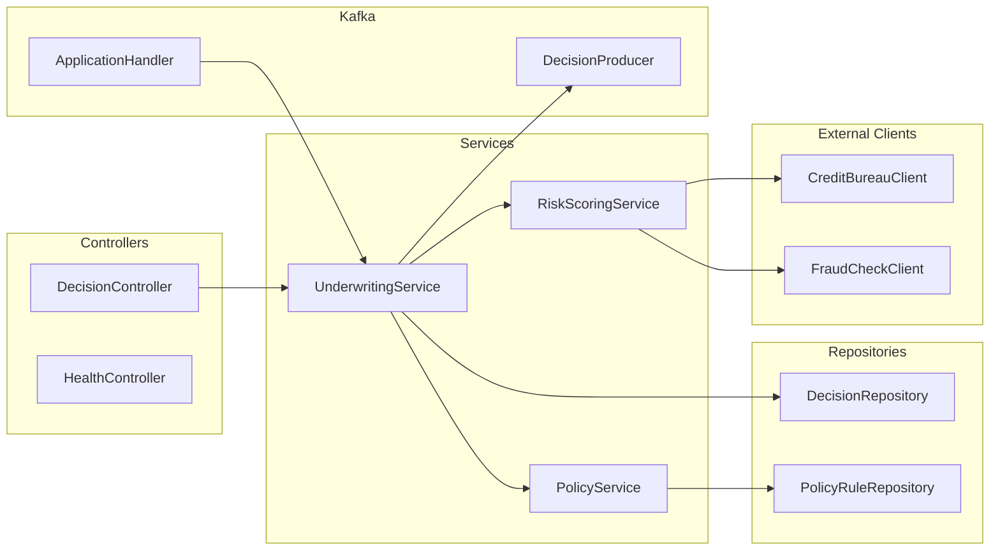
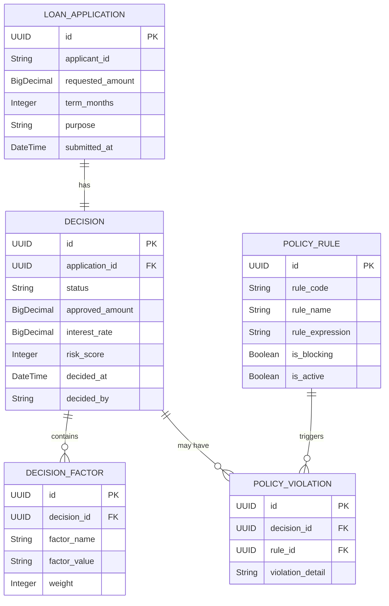

# Loan Approval Service

> Microservice that evaluates loan applications and determines approval decisions based on credit scoring, risk assessment, and business rules.

## Business Overview

### What This Service Does
The Loan Approval Service is the central decision engine for loan applications in the lending platform. It receives loan applications from the origination service, evaluates them against credit policies and risk models, and produces approval or rejection decisions that trigger downstream fulfillment or rejection workflows.

### Key Use Cases
- **Instant Decision**: Evaluate loan applications and provide real-time approval/rejection decisions
- **Risk Assessment**: Calculate risk scores based on credit bureau data and internal models
- **Policy Enforcement**: Apply configurable business rules for loan limits, eligibility, and pricing
- **Decision Audit**: Maintain complete audit trail of all decisions for regulatory compliance

### Domain Glossary
| Term | Definition |
|------|------------|
| Application | A loan request submitted by a customer with personal and financial information |
| Decision | The outcome of evaluating an application (APPROVED, REJECTED, MANUAL_REVIEW) |
| Risk Score | A numerical score (0-1000) indicating the likelihood of default |
| DTI Ratio | Debt-to-Income ratio, a key factor in approval decisions |
| Credit Pull | A request to credit bureaus for applicant's credit history |
| Underwriting | The process of evaluating an application against lending criteria |

---

## Tech Stack

| Technology | Version | Purpose |
|------------|---------|---------|
| Java | 17 | Runtime |
| Spring Boot | 3.2.0 | Application framework |
| Spring Web | - | REST API |
| Spring Data JPA | - | Database access |
| Spring Kafka | - | Event streaming |
| PostgreSQL | 15 | Primary database |
| OpenFeign | - | HTTP client for external services |
| Flyway | - | Database migrations |
| Lombok | - | Boilerplate reduction |
| MapStruct | - | Object mapping |
| Micrometer | - | Metrics and observability |

---

## Architecture

### System Context Diagram



### Component Diagram



---

## Domain Model

### Entity Relationship Diagram



### Key Entities

#### Decision
- **Table:** `loan_decisions`
- **Purpose:** Records the outcome of evaluating a loan application
- **Key Fields:**
  - `id` - Unique identifier (UUID)
  - `application_id` - Reference to the loan application
  - `status` - APPROVED, REJECTED, MANUAL_REVIEW, PENDING
  - `risk_score` - Calculated risk score (0-1000)
  - `approved_amount` - Amount approved (may differ from requested)
  - `interest_rate` - Assigned interest rate based on risk tier
- **Lifecycle:** PENDING → (APPROVED | REJECTED | MANUAL_REVIEW)

#### PolicyRule
- **Table:** `policy_rules`
- **Purpose:** Configurable business rules for loan approval
- **Key Fields:**
  - `rule_code` - Unique rule identifier (e.g., MAX_DTI_RATIO)
  - `rule_expression` - SpEL expression defining the rule
  - `is_blocking` - If true, violation results in rejection
  - `is_active` - Enable/disable rules without deployment

---

## API Reference

### REST Endpoints

| Method | Path | Description | Auth |
|--------|------|-------------|------|
| POST | `/api/v1/decisions` | Evaluate application and create decision | API Key |
| GET | `/api/v1/decisions/{id}` | Get decision by ID | API Key |
| GET | `/api/v1/decisions/application/{applicationId}` | Get decision by application ID | API Key |
| POST | `/api/v1/decisions/{id}/override` | Override decision (manual review) | Admin Role |
| GET | `/api/v1/policies` | List all policy rules | API Key |
| PUT | `/api/v1/policies/{code}` | Update policy rule | Admin Role |

### Request/Response Examples

#### Create Decision (Evaluate Application)
```bash
curl -X POST http://localhost:8080/api/v1/decisions \
  -H "Content-Type: application/json" \
  -H "X-API-Key: your-api-key" \
  -d '{
    "applicationId": "550e8400-e29b-41d4-a716-446655440000",
    "applicantId": "CUST-12345",
    "requestedAmount": 25000.00,
    "termMonths": 36,
    "purpose": "DEBT_CONSOLIDATION",
    "annualIncome": 75000.00,
    "monthlyDebt": 1200.00
  }'
```

Response (201 Created):
```json
{
  "id": "7c9e6679-7425-40de-944b-e07fc1f90ae7",
  "applicationId": "550e8400-e29b-41d4-a716-446655440000",
  "status": "APPROVED",
  "riskScore": 720,
  "riskTier": "LOW",
  "approvedAmount": 25000.00,
  "interestRate": 8.99,
  "termMonths": 36,
  "monthlyPayment": 793.26,
  "decisionFactors": [
    {"factor": "CREDIT_SCORE", "value": "750", "impact": "POSITIVE"},
    {"factor": "DTI_RATIO", "value": "0.19", "impact": "POSITIVE"},
    {"factor": "EMPLOYMENT_LENGTH", "value": "5_YEARS", "impact": "POSITIVE"}
  ],
  "decidedAt": "2024-01-15T10:30:00Z"
}
```

Response (422 - Rejected):
```json
{
  "id": "7c9e6679-7425-40de-944b-e07fc1f90ae8",
  "applicationId": "550e8400-e29b-41d4-a716-446655440001",
  "status": "REJECTED",
  "riskScore": 420,
  "riskTier": "HIGH",
  "rejectionReasons": [
    {"code": "LOW_CREDIT_SCORE", "message": "Credit score below minimum threshold"},
    {"code": "HIGH_DTI", "message": "Debt-to-income ratio exceeds 45%"}
  ],
  "decidedAt": "2024-01-15T10:31:00Z"
}
```

### Kafka Topics

#### Consumed Topics

| Topic | Event Type | Consumer Group | Handler |
|-------|------------|----------------|---------|
| `loan.application.submitted` | `ApplicationSubmittedEvent` | `loan-approval-group` | `ApplicationEventHandler` |
| `credit.score.updated` | `CreditScoreUpdatedEvent` | `loan-approval-group` | `CreditUpdateHandler` |

#### Produced Topics

| Topic | Event Type | Trigger |
|-------|------------|---------|
| `loan.decision.created` | `LoanDecisionEvent` | After every decision |
| `loan.approved` | `LoanApprovedEvent` | When application approved |
| `loan.rejected` | `LoanRejectedEvent` | When application rejected |
| `loan.manual-review` | `ManualReviewRequiredEvent` | When requires manual review |

### Event Schema Examples

#### ApplicationSubmittedEvent (Consumed)
```json
{
  "eventId": "evt-123456",
  "eventType": "APPLICATION_SUBMITTED",
  "timestamp": "2024-01-15T10:29:00Z",
  "payload": {
    "applicationId": "550e8400-e29b-41d4-a716-446655440000",
    "applicantId": "CUST-12345",
    "requestedAmount": 25000.00,
    "termMonths": 36,
    "purpose": "DEBT_CONSOLIDATION"
  }
}
```

#### LoanApprovedEvent (Produced)
```json
{
  "eventId": "evt-789012",
  "eventType": "LOAN_APPROVED",
  "timestamp": "2024-01-15T10:30:00Z",
  "payload": {
    "decisionId": "7c9e6679-7425-40de-944b-e07fc1f90ae7",
    "applicationId": "550e8400-e29b-41d4-a716-446655440000",
    "applicantId": "CUST-12345",
    "approvedAmount": 25000.00,
    "interestRate": 8.99,
    "termMonths": 36,
    "riskTier": "LOW"
  }
}
```

---

## Database Schema

### Tables

#### `loan_decisions`
| Column | Type | Nullable | Description |
|--------|------|----------|-------------|
| id | UUID | NO | Primary key |
| application_id | UUID | NO | Reference to loan application |
| applicant_id | VARCHAR(50) | NO | Customer identifier |
| status | VARCHAR(20) | NO | PENDING, APPROVED, REJECTED, MANUAL_REVIEW |
| risk_score | INTEGER | YES | Calculated risk score (0-1000) |
| risk_tier | VARCHAR(10) | YES | LOW, MEDIUM, HIGH, VERY_HIGH |
| requested_amount | DECIMAL(12,2) | NO | Amount requested |
| approved_amount | DECIMAL(12,2) | YES | Amount approved |
| interest_rate | DECIMAL(5,2) | YES | Assigned rate |
| decided_at | TIMESTAMP | YES | Decision timestamp |
| decided_by | VARCHAR(50) | YES | System or user who made decision |
| created_at | TIMESTAMP | NO | Record creation time |
| updated_at | TIMESTAMP | YES | Last update time |

**Indexes:**
- `idx_decisions_application_id` on `application_id` - Lookup by application
- `idx_decisions_applicant_id` on `applicant_id` - Lookup by customer
- `idx_decisions_status` on `status` - Filter by status
- `idx_decisions_decided_at` on `decided_at` - Time-based queries

#### `policy_rules`
| Column | Type | Nullable | Description |
|--------|------|----------|-------------|
| id | UUID | NO | Primary key |
| rule_code | VARCHAR(50) | NO | Unique rule identifier |
| rule_name | VARCHAR(100) | NO | Human-readable name |
| rule_expression | TEXT | NO | SpEL expression |
| is_blocking | BOOLEAN | NO | Causes rejection if violated |
| is_active | BOOLEAN | NO | Rule enabled/disabled |
| created_at | TIMESTAMP | NO | Creation time |
| updated_at | TIMESTAMP | YES | Last update |

### Migrations
- Location: `src/main/resources/db/migration/`
- Tool: Flyway
- Naming: `V{version}__{description}.sql`

---

## Integration Points

### Upstream Dependencies
| System | Type | Purpose | Critical |
|--------|------|---------|----------|
| Loan Origination | Kafka | Receives new applications | Yes |
| Credit Bureau API | HTTP (Feign) | Credit score and history | Yes |
| Fraud Detection | HTTP (Feign) | Fraud risk assessment | No (degraded mode available) |

### Downstream Dependencies
| System | Type | Purpose | Critical |
|--------|------|---------|----------|
| Loan Fulfillment | Kafka | Triggers loan disbursement | Yes |
| Notification Service | Kafka | Customer notifications | No |
| Analytics Platform | Kafka | Decision analytics | No |

### External APIs

| Service | Base URL | Purpose |
|---------|----------|---------|
| Credit Bureau | `https://api.creditbureau.example.com` | Credit pulls |
| Fraud Check | `https://fraud.internal.example.com` | Risk scoring |

---

## Exception Handling

### Exception Hierarchy

```
LoanApprovalException (extends RuntimeException)
├── ApplicationValidationException
│   ├── InvalidAmountException
│   ├── InvalidTermException
│   └── MissingRequiredFieldException
├── DecisionException
│   ├── ApplicationNotFoundException
│   ├── DecisionAlreadyExistsException
│   └── DecisionLockedException
├── PolicyException
│   ├── PolicyRuleNotFoundException
│   └── PolicyEvaluationException
└── IntegrationException
    ├── CreditBureauException
    ├── FraudServiceException
    └── EventPublishingException
```

### Error Responses

| Exception | HTTP Status | Error Code | Description |
|-----------|-------------|------------|-------------|
| ApplicationNotFoundException | 404 | LOAN_001 | Application not found |
| DecisionAlreadyExistsException | 409 | LOAN_002 | Decision already exists for application |
| InvalidAmountException | 400 | LOAN_003 | Amount outside allowed range |
| CreditBureauException | 502 | LOAN_004 | Credit bureau unavailable |
| PolicyEvaluationException | 500 | LOAN_005 | Error evaluating policy rules |

### Error Response Format
```json
{
  "timestamp": "2024-01-15T10:30:00Z",
  "status": 400,
  "error": "Bad Request",
  "code": "LOAN_003",
  "message": "Requested amount must be between $1,000 and $100,000",
  "path": "/api/v1/decisions",
  "traceId": "abc123def456"
}
```

---

## Local Development Setup

### Prerequisites
- Java 17 (OpenJDK or similar)
- Maven 3.8+
- Docker & Docker Compose
- IDE (IntelliJ IDEA recommended)

### Environment Setup

1. **Clone the repository**
   ```bash
   git clone https://github.com/example/loan-approval-service.git
   cd loan-approval-service
   ```

2. **Start dependencies**
   ```bash
   docker-compose up -d postgres kafka zookeeper
   ```

3. **Configure environment**
   ```bash
   cp src/main/resources/application-local.yml.example src/main/resources/application-local.yml
   ```

   Update the following in `application-local.yml`:
   ```yaml
   credit-bureau:
     api-key: ${CREDIT_BUREAU_API_KEY:test-key}

   fraud-service:
     base-url: http://localhost:8081
   ```

4. **Run the application**
   ```bash
   ./mvnw spring-boot:run -Dspring-boot.run.profiles=local
   ```

5. **Verify**
   ```bash
   curl http://localhost:8080/actuator/health
   ```

### Configuration Properties

| Property | Description | Default | Required |
|----------|-------------|---------|----------|
| `server.port` | Server port | 8080 | No |
| `spring.datasource.url` | Database URL | - | Yes |
| `spring.kafka.bootstrap-servers` | Kafka servers | localhost:9092 | Yes |
| `credit-bureau.base-url` | Credit bureau API URL | - | Yes |
| `credit-bureau.api-key` | API key for credit bureau | - | Yes |
| `fraud-service.base-url` | Fraud service URL | - | No |
| `fraud-service.timeout-ms` | Fraud check timeout | 5000 | No |

### Running Tests

```bash
# Unit tests
./mvnw test

# Integration tests (requires Docker)
./mvnw verify -P integration-tests

# With coverage report
./mvnw test jacoco:report
# Report at: target/site/jacoco/index.html

# Specific test class
./mvnw test -Dtest=UnderwritingServiceTest
```

---

## Design Patterns & Decisions

### Architectural Patterns
- **Event-Driven Architecture**: Decisions are triggered by events and produce events for downstream processing
- **Domain-Driven Design**: Clear bounded context with rich domain model
- **Hexagonal Architecture**: Core business logic isolated from external concerns

### Key Design Decisions

| Decision | Rationale | Alternatives Considered |
|----------|-----------|------------------------|
| SpEL for policy rules | Allows runtime configuration without deployment | Drools (too heavy), hardcoded (inflexible) |
| Synchronous credit pull | Required for decision accuracy | Async with cache (stale data risk) |
| UUID for IDs | Distributed ID generation, no coordination needed | Sequences (requires DB coordination) |
| Event sourcing for audit | Complete audit trail for compliance | Audit log table (less queryable) |

---

## Troubleshooting

### Common Issues

#### Decision Timeout
**Symptoms:** Decision requests timing out, 504 errors
**Cause:** Credit bureau API slow or unresponsive
**Solution:**
1. Check credit bureau health: `curl https://api.creditbureau.example.com/health`
2. Review timeout settings in `application.yml`
3. Check for circuit breaker status in actuator

#### Kafka Consumer Lag
**Symptoms:** Decisions delayed, events piling up
**Cause:** Processing slower than event production
**Solution:**
1. Check consumer lag: `kafka-consumer-groups --bootstrap-server localhost:9092 --describe --group loan-approval-group`
2. Scale up consumers (increase `concurrency`)
3. Check for blocking operations in handlers

#### Policy Rule Errors
**Symptoms:** 500 errors during decision, PolicyEvaluationException
**Cause:** Invalid SpEL expression in policy rule
**Solution:**
1. Check logs for rule code and expression
2. Validate expression syntax
3. Disable problematic rule: `PUT /api/v1/policies/{code}` with `isActive: false`

### Useful Commands

```bash
# Check service health
curl http://localhost:8080/actuator/health

# View decision metrics
curl http://localhost:8080/actuator/metrics/decisions.processed

# Check Kafka consumer lag
kafka-consumer-groups --bootstrap-server localhost:9092 \
  --describe --group loan-approval-group

# View recent decisions
psql -h localhost -U postgres -d loan_decisions \
  -c "SELECT * FROM loan_decisions ORDER BY created_at DESC LIMIT 10;"
```

### Key Metrics
- `decisions.processed` - Total decisions made (counter)
- `decisions.processing.time` - Decision processing duration (timer)
- `credit.bureau.requests` - Credit bureau API calls (counter)
- `kafka.consumer.lag` - Consumer lag by partition (gauge)

---

## Contributing

See [CONTRIBUTING.md](CONTRIBUTING.md) for development guidelines and code review requirements.

## License

Proprietary - Example Corp. All rights reserved.
