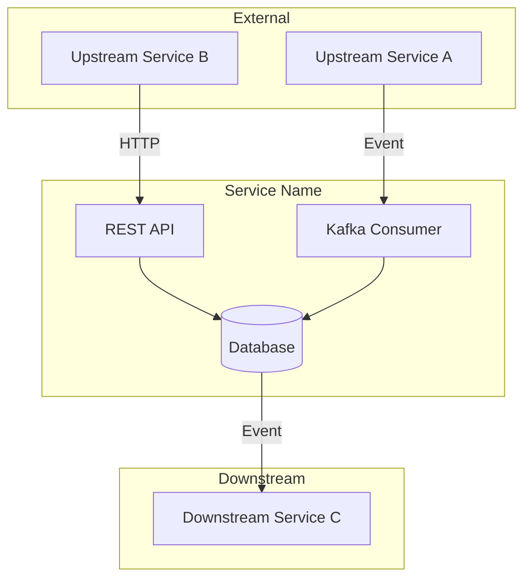

# Document Spring Project Skill

## Description

This skill combines **automated technical analysis** of Spring Boot codebases with an **interactive interview process** to generate comprehensive, context-rich documentation. It produces two key artifacts:

1. **README.md** - Complete project documentation including architecture diagrams, API docs, and setup instructions
2. **.claude/instructions.md** - AI-assistant guidelines for working with the codebase

**CRITICAL FEATURE**: This skill also **maintains documentation in sync with code changes**. Whenever Claude modifies the codebase, it should check if documentation needs updating and proactively update it.

## When to Use This Skill

### For Initial Documentation

**INVOKE THIS SKILL** when the user says any of:

- "document this service" / "document this project"
- "generate README" / "create documentation"
- "create .claude/instructions.md" / "create claude instructions"
- "analyze this microservice"
- "document this Spring Boot app"
- "create project documentation"
- "generate docs for this service"
- "I need documentation for this project"

### For Documentation Maintenance (PROACTIVE)

**AUTOMATICALLY UPDATE DOCUMENTATION** when Claude has just:

- Added a new REST endpoint
- Added a new Kafka consumer or producer
- Created a new entity/table
- Added a new external service integration (Feign, RestTemplate)
- Modified existing API contracts (changed request/response)
- Changed database schema
- Added new configuration properties
- Modified business logic that's documented
- Added new dependencies
- Changed service architecture

**INVOKE THIS SKILL PROACTIVELY** after any code change that affects:
- API contracts (endpoints, request/response formats)
- Event contracts (Kafka topics, event schemas)
- Data models (entities, DTOs)
- Integration points (external services)
- Configuration requirements
- Setup/deployment instructions

## What This Skill Does

### Mode 1: Initial Documentation (Full Process)

#### Phase 1: Technical Analysis (Automated)

Run the analysis script to automatically extract technical details:

```bash
# Execute from skill directory
bash scripts/analyze.sh /path/to/project
```

**The analysis extracts:**

| Category | What's Detected |
|----------|-----------------|
| **Build System** | Maven (pom.xml) or Gradle (build.gradle), Java version, Spring Boot version |
| **Dependencies** | Spring Web, Spring Data JPA, Spring Kafka, Spring Security, Feign, etc. |
| **REST Endpoints** | All @Controller/@RestController classes with @GetMapping, @PostMapping, @PutMapping, @DeleteMapping, @PatchMapping |
| **Kafka Integration** | @KafkaListener (topics, group IDs), KafkaTemplate.send() calls |
| **Database Entities** | @Entity classes with @Table names, @Document for MongoDB |
| **External Calls** | @FeignClient interfaces, RestTemplate usage, WebClient usage |
| **Service Layer** | Classes matching *Service.java pattern in service packages |
| **Configuration** | application.yml/properties: server.port, spring.application.name, database URLs, Kafka bootstrap servers |
| **Tests** | JUnit/TestNG test counts, integration test patterns |

**Present analysis results to user before starting interview.**

#### Phase 2: Interactive Interview

After presenting technical findings, conduct an interactive interview to gather business context. **Critical rules:**

1. **Maximum 2 questions at a time** - never overwhelm the user
2. **Wait for response** before asking more questions
3. **Present relevant technical findings** before each question set
4. **Summarize user's response** before moving to next section
5. **Confirm understanding** before proceeding

##### Interview Sections

**Section 1: Business Context (2-3 questions)**

*Before asking, show:* Detected service name, main endpoints, entities

Questions to ask:
1. "What is the primary business purpose of this service? What problem does it solve for the business?"
2. "What domain terminology should I understand? Are there business terms that have specific meanings in this context?"
3. "What are the 2-3 most critical business rules this service enforces?"

**Section 2: Architecture & Integration (3-4 questions)**

*Before asking, show:* Detected Kafka topics, Feign clients, external calls

Questions to ask:
1. "What services/systems send data TO this service? (upstream dependencies)"
2. "What services/systems consume data FROM this service? (downstream dependencies)"
3. "For the synchronous API calls I detected, which are critical vs. optional?"
4. "Can you describe a typical data flow through this service from trigger to completion?"

**Section 3: Data & State (2 questions)**

*Before asking, show:* Detected entities, database type, table names

Questions to ask:
1. "Are there additional fields or relationships in the database that aren't visible in the entity classes?"
2. "What is the lifecycle of the main data entities? (created, updated, archived, deleted?)"

**Section 4: Business Rules (2-3 questions)**

*Before asking, show:* Detected service classes, validation patterns

Questions to ask:
1. "What business logic is critical and must never be modified without careful review?"
2. "Are there approval workflows, state machines, or multi-step processes I should know about?"
3. "What edge cases or special scenarios does this service handle?"

**Section 5: Operational Context (2 questions)**

*Before asking, show:* Detected configuration, environment variables

Questions to ask:
1. "Are there runtime dependencies not visible in code? (external APIs, scheduled jobs, feature flags)"
2. "What metrics or logs are important for monitoring this service's health?"

**Section 6: Development Context (2 questions)**

*Before asking, show:* Detected test patterns, code structure

Questions to ask:
1. "Are there coding conventions or patterns specific to this project I should follow?"
2. "What are known issues, technical debt items, or planned improvements?"

#### Phase 3: Documentation Generation

Generate README.md and .claude/instructions.md with all gathered information.

---

### Mode 2: Documentation Maintenance (After Code Changes)

**THIS IS CRITICAL**: After Claude makes code changes, documentation must be kept in sync.

#### When to Trigger Documentation Update

After completing ANY code modification, check if the change affects:

| Change Type | Documentation Impact |
|-------------|---------------------|
| New endpoint added | Update API Reference section in README |
| Endpoint modified | Update API Reference, possibly Architecture |
| New Kafka consumer | Update Kafka Topics section, Architecture diagram |
| New Kafka producer | Update Kafka Topics section |
| New entity/table | Update Domain Model, Database Schema sections |
| New Feign client | Update Integration Points, Architecture diagram |
| New dependency added | Update Tech Stack section |
| Config property added | Update Local Development Setup section |
| Business logic changed | Update .claude/instructions.md Business Rules |
| New service class | Update .claude/instructions.md Code Organization |

#### Documentation Update Process

```
[After completing code changes]
           ↓
[Check: Does this change affect documented information?]
           ↓
    YES → [Read current README.md and .claude/instructions.md]
           ↓
         [Identify sections that need updating]
           ↓
         [Update affected sections ONLY]
           ↓
         [Inform user: "I've updated the documentation to reflect these changes:
           - Added new endpoint X to API Reference
           - Updated Architecture diagram with new integration"]
           ↓
    NO  → [Continue without doc changes]
```

#### What to Update for Each Change Type

**New REST Endpoint:**
```markdown
README.md updates:
- API Reference table: add new row with Method, Path, Description
- If new controller: add to component list

.claude/instructions.md updates:
- Common Tasks section if it's a common pattern
```

**New Kafka Consumer:**
```markdown
README.md updates:
- Kafka Topics "Consumed" table: Topic, Event Type, Handler
- Architecture diagram: add event flow arrow

.claude/instructions.md updates:
- Integration Dependencies section
- Add to "Adding a new Kafka consumer" example
```

**New Entity/Table:**
```markdown
README.md updates:
- Domain Model: add entity to diagram
- Database Schema: add table details

.claude/instructions.md updates:
- Business Domain if it's a new concept
```

**New External Integration:**
```markdown
README.md updates:
- Integration Points: add to upstream/downstream list
- Architecture diagram: add external system
- Tech Stack if new client library added

.claude/instructions.md updates:
- Integration Dependencies: add critical info
- When Modifying: add guidelines if special handling needed
```

**Configuration Change:**
```markdown
README.md updates:
- Local Development Setup: add new config property
- Prerequisites if new external dependency

.claude/instructions.md updates:
- Service Responsibilities if scope changed
```

#### Update Message Template

After updating documentation, inform the user:

```
Documentation updated to reflect code changes:

README.md:
- [Section]: [What was added/changed]

.claude/instructions.md:
- [Section]: [What was added/changed]
```

---

### Mode 3: Quick Documentation (Skip Interview)

When user requests quick docs or when updating:

1. Run technical analysis only
2. Generate documentation from code analysis
3. Mark business context sections with "TODO: Add business context"
4. Inform user that docs are technical-only

---

## Interview Guidelines

### Pacing Rules

1. **Never ask more than 2 questions in a single message**
2. **Always wait for user response before continuing**
3. **If user gives brief answer, ask clarifying follow-up**
4. **If user says "skip" or "I don't know", move on gracefully**

### Conversation Flow

```
[Show technical findings summary]
↓
"Based on my analysis, I found [X]. Let me ask about the business context..."
↓
[Ask 1-2 questions]
↓
[Wait for response]
↓
"Thanks! So [summarize understanding]. Let me ask about [next topic]..."
↓
[Ask 1-2 questions]
↓
[Repeat until all sections covered]
↓
"I now have enough context. Let me generate the documentation..."
↓
[Generate README.md]
↓
[Generate .claude/instructions.md]
↓
"Documentation complete! Here's what I created: [summary]"
```

### Handling Responses

- **Detailed response**: Summarize key points, move to next section
- **Brief response**: Ask one follow-up for clarity
- **"I don't know"**: Note the gap, move on
- **"Skip this"**: Respect request, move on
- **Off-topic response**: Gently redirect to the question

## Expected Outputs

### README.md Structure

```markdown
# Service Name

> One-line description from business context

## Business Overview
- What problem it solves
- Key business value
- Domain terminology glossary

## Tech Stack
| Technology | Version | Purpose |
|------------|---------|---------|
| Java | X | Runtime |
| Spring Boot | X.X.X | Framework |
| ... | ... | ... |

## Architecture

### System Context Diagram


### Component Diagram
[Internal service components]

## Domain Model
- Entity relationship diagram (Mermaid)
- Key entities and their relationships

## API Reference
### REST Endpoints
| Method | Path | Description |
|--------|------|-------------|
| GET | /api/v1/... | ... |

### Kafka Topics
**Consumed:**
| Topic | Event Type | Handler |
|-------|------------|---------|

**Produced:**
| Topic | Event Type | Trigger |
|-------|------------|---------|

## Database Schema
- Tables/Collections
- Key indexes
- Data lifecycle

## Integration Points
- Upstream dependencies
- Downstream dependencies
- External APIs

## Local Development Setup
1. Prerequisites
2. Configuration
3. Running locally
4. Running tests

## Design Patterns & Decisions
- Why certain approaches were chosen
- Key architectural decisions

## Troubleshooting
- Common issues
- Debug tips
```

### .claude/instructions.md Structure

```markdown
# Claude Instructions for [Service Name]

## Business Domain
[Domain context and terminology]

## Service Responsibilities
[What this service does and doesn't do]

## Integration Dependencies
- Critical dependencies that must be considered
- Event contracts
- API contracts

## Architecture Patterns
[Patterns used: CQRS, Event Sourcing, DDD, etc.]

## Code Organization
[Package structure and conventions]

## Business Rules
[Critical rules to preserve]

## When Modifying This Service
### DO:
- [Guidelines]

### DON'T:
- [Anti-patterns to avoid]

## Testing Requirements
[What needs tests, coverage expectations]

## Common Tasks
### Adding a new endpoint
[Steps]

### Adding a new Kafka consumer
[Steps]

### Modifying business logic
[Steps]

## Documentation Maintenance
When modifying this service, update:
- README.md: API Reference, Architecture diagrams, Setup instructions
- This file: Business rules, Integration dependencies
```

## Technical Requirements

### Supported Technologies

- **Java**: 11, 17, 21
- **Spring Boot**: 2.x, 3.x
- **Build Tools**: Maven, Gradle
- **Databases**: PostgreSQL, MySQL, MongoDB, H2
- **Messaging**: Apache Kafka, RabbitMQ
- **HTTP Clients**: Feign, RestTemplate, WebClient

### Analysis Tools

The skill requires these CLI tools:
- `bash` (4.0+)
- `grep` (with -r, -E support)
- `find`
- `sed`
- `awk`

## Usage Examples

### Example 1: Initial Documentation

```
User: "Document this Spring Boot service"

Claude: "I'll analyze this project and generate comprehensive documentation. Let me start with technical analysis..."

[Runs analyze.sh]

Claude: "Here's what I found:
- Spring Boot 3.2.0 with Java 17
- 12 REST endpoints in 3 controllers
- 2 Kafka consumers (order-events, payment-events)
- 5 JPA entities (Order, Customer, Product, Payment, Shipment)
- Feign client calling inventory-service

Let me understand the business context. What is the primary purpose of this service? What business problem does it solve?"

User: "It's our order management service. It handles the complete order lifecycle from creation to fulfillment."

Claude: "Got it - this is the order management service handling the full order lifecycle. What are the key business rules around order processing? For example, validation rules, state transitions, or approval requirements?"

[Interview continues...]

Claude: "I now have enough context. Generating documentation..."

[Creates README.md and .claude/instructions.md]

Claude: "Done! I've created:
- README.md with architecture diagrams, API reference, and setup guide
- .claude/instructions.md with development guidelines

Would you like me to walk through any section?"
```

### Example 2: Documentation Auto-Update After Code Change

```
User: "Add a new endpoint to cancel orders"

Claude: [Implements the endpoint]

"I've added the cancel order endpoint:
- POST /api/v1/orders/{id}/cancel

I've also updated the documentation:

README.md:
- API Reference: Added cancel endpoint row

.claude/instructions.md:
- Common Tasks: Added 'Canceling an order' section with state transition rules

Want me to add any additional details to the documentation?"
```

### Example 3: Adding New Kafka Consumer

```
User: "Add a consumer for shipment-events topic"

Claude: [Implements the Kafka consumer]

"I've added the shipment events consumer:
- Topic: shipment-events
- Handler: ShipmentEventHandler
- Processing: Updates order status on shipment events

Documentation updated:

README.md:
- Kafka Topics (Consumed): Added shipment-events row
- Architecture diagram: Added shipment-service as upstream dependency

.claude/instructions.md:
- Integration Dependencies: Added shipment-events contract info"
```

### Example 4: Quick Mode (Skip Interview)

```
User: "Generate quick docs for this service - skip the interview"

Claude: "I'll generate documentation based purely on technical analysis. Note that business context sections will be minimal..."

[Runs analyze.sh]
[Generates documentation with technical details only]
[Marks business sections as "TODO: Add business context"]
```

### Example 5: Update Existing Docs

```
User: "Update the README with new endpoints I added"

Claude: "I'll analyze the current codebase and compare with existing documentation..."

[Runs analyze.sh]
[Reads existing README.md]
[Identifies new endpoints]

Claude: "I found 3 new endpoints not in the current README:
- POST /api/v1/orders/{id}/cancel
- GET /api/v1/orders/{id}/history
- PUT /api/v1/orders/{id}/priority

Quick questions about these:
1. What triggers order cancellation? Are there restrictions?
2. What does the priority field affect in order processing?"

[Updates documentation after brief interview]
```

## Checklist

### Initial Documentation Checklist

- [ ] Run technical analysis script
- [ ] Present findings summary to user
- [ ] Complete Business Context interview section
- [ ] Complete Architecture & Integration interview section
- [ ] Complete Data & State interview section
- [ ] Complete Business Rules interview section
- [ ] Complete Operational Context interview section
- [ ] Complete Development Context interview section
- [ ] Generate README.md
- [ ] Generate .claude/instructions.md
- [ ] Review generated docs with user
- [ ] Make requested adjustments

### Documentation Maintenance Checklist (After Code Changes)

- [ ] Identify what type of change was made
- [ ] Check if change affects documented information
- [ ] Read current documentation files
- [ ] Update affected sections in README.md
- [ ] Update affected sections in .claude/instructions.md
- [ ] Inform user of documentation updates

## Error Handling

| Scenario | Action |
|----------|--------|
| Not a Spring Boot project | Inform user, offer to document as generic Java project |
| No pom.xml or build.gradle | Ask user about build system |
| Analysis script fails | Fall back to manual file inspection |
| User wants to skip interview | Generate docs with "TODO" placeholders for business context |
| Existing docs found | Ask if updating or replacing |
| No existing docs when updating | Run full documentation process |

## Notes

- Always run analysis before starting interview
- Technical findings inform better interview questions
- Business context dramatically improves documentation quality
- Mermaid diagrams require user validation
- Offer to iterate on generated documentation
- **ALWAYS check if documentation needs updating after code changes**
- Keep documentation updates minimal and focused - only update what changed
- Inform user of documentation updates so they can review
