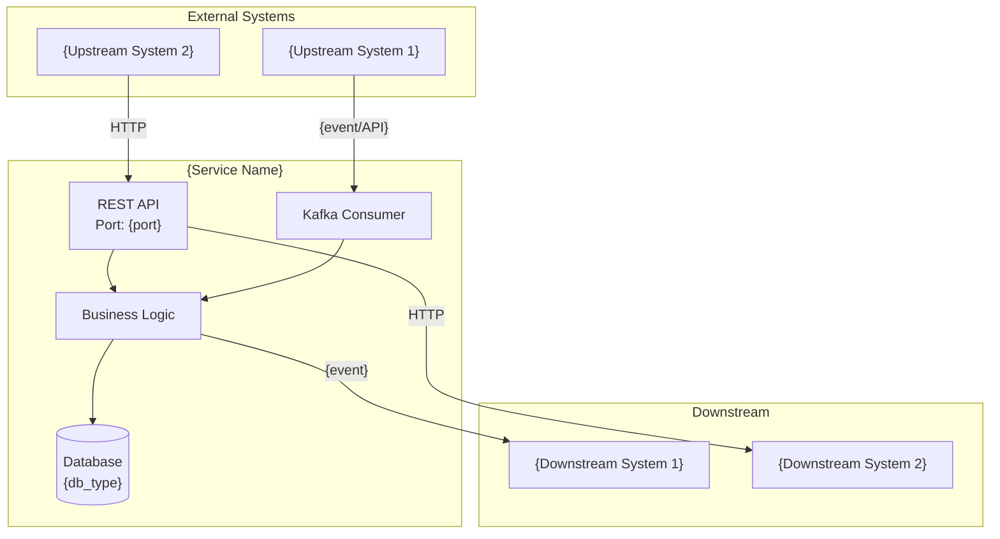
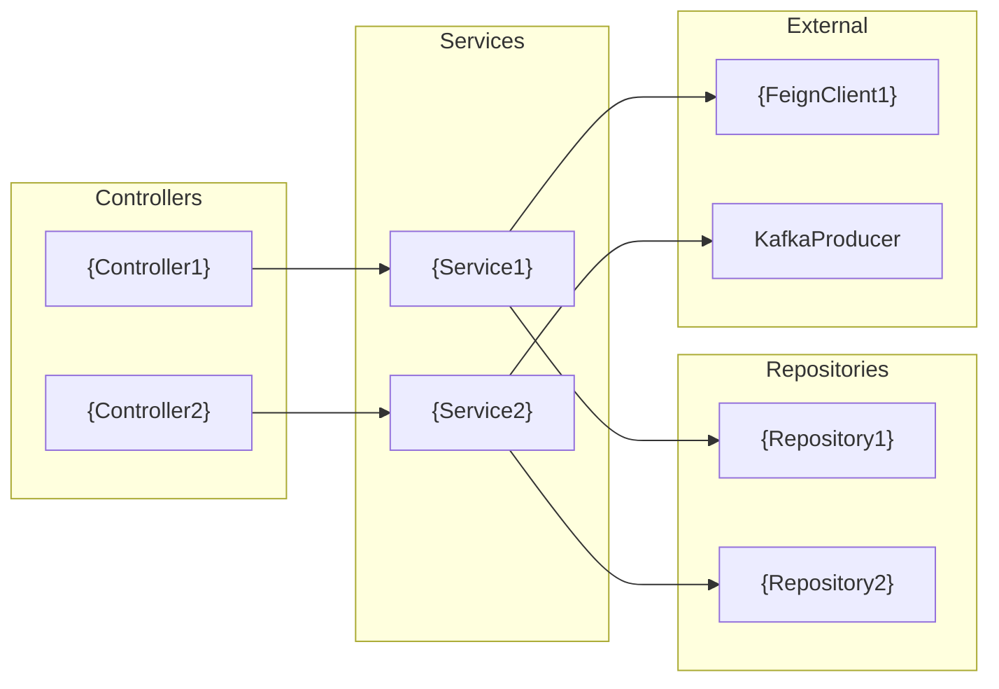

# README.md Template

Use this template structure when generating README.md files for Spring Boot services.

---

```markdown
# {Service Name}

> {One-line description of the service's business purpose}

## Business Overview

### What This Service Does
{2-3 sentences explaining the business value and primary function}

### Key Use Cases
- {Use case 1}
- {Use case 2}
- {Use case 3}

### Domain Glossary
| Term | Definition |
|------|------------|
| {Term 1} | {Definition} |
| {Term 2} | {Definition} |

---

## Tech Stack

| Technology | Version | Purpose |
|------------|---------|---------|
| Java | {version} | Runtime |
| Spring Boot | {version} | Application framework |
| Spring Web | - | REST API |
| Spring Data JPA | - | Database access |
| PostgreSQL | {version} | Primary database |
| Apache Kafka | - | Event streaming |
| {Other dependencies} | {version} | {purpose} |

---

## Architecture

### System Context Diagram



### Component Diagram



---

## Domain Model

### Entity Relationship Diagram

```mermaid
erDiagram
    {ENTITY1} ||--o{ {ENTITY2} : "has many"
    {ENTITY1} {
        Long id PK
        String field1
        DateTime createdAt
    }
    {ENTITY2} {
        Long id PK
        Long entity1Id FK
        String field2
        String status
    }
```

### Key Entities

#### {Entity1}
- **Table:** `{table_name}`
- **Purpose:** {business purpose}
- **Key Fields:**
  - `id` - Primary identifier
  - `{field}` - {description}
- **Lifecycle:** Created → Updated → {final_state}

#### {Entity2}
- **Table:** `{table_name}`
- **Purpose:** {business purpose}
- **Key Fields:**
  - `id` - Primary identifier
  - `{field}` - {description}

---

## API Reference

### REST Endpoints

| Method | Path | Description | Auth |
|--------|------|-------------|------|
| GET | `/api/v1/{resource}` | List all {resources} | {auth_level} |
| GET | `/api/v1/{resource}/{id}` | Get {resource} by ID | {auth_level} |
| POST | `/api/v1/{resource}` | Create new {resource} | {auth_level} |
| PUT | `/api/v1/{resource}/{id}` | Update {resource} | {auth_level} |
| DELETE | `/api/v1/{resource}/{id}` | Delete {resource} | {auth_level} |

### Request/Response Examples

#### Create {Resource}
```bash
curl -X POST http://localhost:{port}/api/v1/{resource} \
  -H "Content-Type: application/json" \
  -d '{
    "field1": "value1",
    "field2": "value2"
  }'
```

Response:
```json
{
  "id": 1,
  "field1": "value1",
  "field2": "value2",
  "createdAt": "2024-01-15T10:30:00Z"
}
```

### Kafka Topics

#### Consumed Topics

| Topic | Event Type | Consumer Group | Handler |
|-------|------------|----------------|---------|
| `{topic-name}` | `{EventType}` | `{group-id}` | `{HandlerClass}` |

#### Produced Topics

| Topic | Event Type | Trigger |
|-------|------------|---------|
| `{topic-name}` | `{EventType}` | {when produced} |

### Event Schema Examples

#### {EventType}
```json
{
  "eventId": "uuid",
  "eventType": "{EventType}",
  "timestamp": "2024-01-15T10:30:00Z",
  "payload": {
    "field1": "value1"
  }
}
```

---

## Database Schema

### Tables

#### `{table_name}`
| Column | Type | Nullable | Description |
|--------|------|----------|-------------|
| id | BIGINT | NO | Primary key |
| {column} | {type} | {nullable} | {description} |
| created_at | TIMESTAMP | NO | Creation timestamp |
| updated_at | TIMESTAMP | YES | Last update timestamp |

**Indexes:**
- `idx_{table}_{column}` on `{column}` - {purpose}

**Constraints:**
- FK: `{column}` references `{other_table}(id)`

### Migrations
- Location: `src/main/resources/db/migration/`
- Tool: {Flyway/Liquibase}

---

## Integration Points

### Upstream Dependencies
| System | Type | Purpose | Critical |
|--------|------|---------|----------|
| {Service A} | Kafka | {purpose} | Yes |
| {Service B} | HTTP | {purpose} | No |

### Downstream Dependencies
| System | Type | Purpose | Critical |
|--------|------|---------|----------|
| {Service C} | Kafka | {purpose} | Yes |

### External APIs
| Service | Base URL | Purpose |
|---------|----------|---------|
| {External Service} | `{url}` | {purpose} |

---

## Exception Handling

### Exception Hierarchy

```
{BaseException} (extends RuntimeException)
├── {ValidationException}
│   ├── {InvalidFieldException}
│   └── {MissingRequiredFieldException}
├── {BusinessException}
│   ├── {EntityNotFoundException}
│   └── {DuplicateEntityException}
└── {IntegrationException}
    ├── {ExternalServiceException}
    └── {EventProcessingException}
```

### Error Responses

| Exception | HTTP Status | Error Code | Description |
|-----------|-------------|------------|-------------|
| {EntityNotFoundException} | 404 | {CODE_001} | {description} |
| {ValidationException} | 400 | {CODE_002} | {description} |
| {DuplicateEntityException} | 409 | {CODE_003} | {description} |

### Error Response Format
```json
{
  "timestamp": "2024-01-15T10:30:00Z",
  "status": 400,
  "error": "Bad Request",
  "code": "{ERROR_CODE}",
  "message": "{Human readable message}",
  "path": "/api/v1/{resource}"
}
```

---

## Local Development Setup

### Prerequisites
- Java {version}
- Maven/Gradle
- Docker & Docker Compose
- {Other tools}

### Environment Setup

1. **Clone the repository**
   ```bash
   git clone {repo_url}
   cd {service-name}
   ```

2. **Start dependencies**
   ```bash
   docker-compose up -d
   ```

3. **Configure environment**
   ```bash
   cp src/main/resources/application-local.yml.example src/main/resources/application-local.yml
   # Edit configuration as needed
   ```

4. **Run the application**
   ```bash
   ./mvnw spring-boot:run -Dspring-boot.run.profiles=local
   # or
   ./gradlew bootRun --args='--spring.profiles.active=local'
   ```

5. **Verify**
   ```bash
   curl http://localhost:{port}/actuator/health
   ```

### Configuration Properties

| Property | Description | Default | Required |
|----------|-------------|---------|----------|
| `server.port` | Server port | 8080 | No |
| `spring.datasource.url` | Database URL | - | Yes |
| `spring.kafka.bootstrap-servers` | Kafka servers | - | Yes |

### Running Tests

```bash
# Unit tests
./mvnw test

# Integration tests
./mvnw verify -P integration-tests

# With coverage
./mvnw test jacoco:report
```

---

## Design Patterns & Decisions

### Architectural Patterns
- **{Pattern 1}**: {Why it was chosen and how it's used}
- **{Pattern 2}**: {Why it was chosen and how it's used}

### Key Design Decisions

| Decision | Rationale | Alternatives Considered |
|----------|-----------|------------------------|
| {Decision 1} | {Why} | {Other options} |
| {Decision 2} | {Why} | {Other options} |

---

## Troubleshooting

### Common Issues

#### {Issue 1}
**Symptoms:** {What you see}
**Cause:** {Root cause}
**Solution:** {How to fix}

#### {Issue 2}
**Symptoms:** {What you see}
**Cause:** {Root cause}
**Solution:** {How to fix}

### Useful Commands

```bash
# Check service health
curl http://localhost:{port}/actuator/health

# View logs
docker logs -f {container_name}

# Check Kafka consumer lag
kafka-consumer-groups --bootstrap-server localhost:9092 --describe --group {group-id}
```

### Key Metrics
- `{metric.name}` - {What it indicates}
- `{metric.name}` - {What it indicates}

---

## Contributing

See [CONTRIBUTING.md](CONTRIBUTING.md) for development guidelines.

## License

{License information}
```
